# UCLA MSBA AI Assistant

> AI-powered Chrome extension for UCLA Anderson MSBA program

## Overview

The UCLA MSBA AI Assistant is an intelligent Chrome extension that provides accurate, real-time answers about the Master of Science in Business Analytics program. Built with LangChain and ReAct framework, it delivers concise responses with direct links to official MSBA pages.

## Features

- **ReAct Framework**: Intelligent reasoning and action-based query processing
- **MSBA Knowledge Base**: Comprehensive information about prerequisites, fees, admissions, academics, and career outcomes
- **Video Support**: Embedded YouTube videos for program overview and student life
- **Chat History**: Persistent conversation history across sessions
- **UCLA Branding**: Official UCLA Anderson colors and styling
- **Smart Links**: Automatic link deduplication and button-style formatting

## Quick Start

### Installation

1. Clone or download this repository
2. Open Chrome and navigate to `chrome://extensions/`
3. Enable "Developer mode" (top right)
4. Click "Load unpacked"
5. Select the `msba-agent` folder

### Configuration

1. Click the extension icon in Chrome toolbar
2. Enter your API key:
   - **DeepSeek**: Get your API key from [DeepSeek](https://platform.deepseek.com/)
   - **OpenAI**: Use your OpenAI API key
3. Select your preferred model
4. Click "Save Settings"
5. Refresh any open MSBA pages

### Usage

- **Open Assistant**: Press `Command+K` (Mac) or `Ctrl+K` (Windows)
- **Ask Questions**: Type questions about MSBA program, prerequisites, fees, admissions, etc.
- **View Videos**: Ask "show me videos about msba" to see embedded videos
- **Close**: Press `Command+K` again or click the × button

## Architecture

### System Architecture Diagram

```mermaid
graph LR
    A[User Query] --> B[MSBA Agent]
    B --> C[LangChain Adapter]
    C --> D{Type?}
    D -->|MSBA| E[ReAct]
    D -->|General| F[Conversation]
    
    E --> G[Think]
    G --> H[Act]
    H --> I[Knowledge Base]
    I --> J[Observe]
    J --> K{More?}
    K -->|Yes| G
    K -->|No| L[Answer]
    
    E --> M[LLM API]
    F --> M
    M --> L
    L --> N[UI Sidebar]

    style A fill:#4A90E2,stroke:#0055CC,stroke-width:2px,color:#fff
    style B fill:#0055CC,stroke:#FFD100,stroke-width:3px,color:#fff
    style C fill:#4A90E2,stroke:#003DA5,stroke-width:2px,color:#fff
    style D fill:#FFD100,stroke:#0055CC,stroke-width:2px
    style E fill:#FFD100,stroke:#0055CC,stroke-width:2px
    style F fill:#FFF9E6,stroke:#FFD100,stroke-width:2px
    style G fill:#4A90E2,stroke:#0055CC,stroke-width:2px,color:#fff
    style H fill:#4A90E2,stroke:#0055CC,stroke-width:2px,color:#fff
    style I fill:#FFF9E6,stroke:#FFD100,stroke-width:2px
    style J fill:#4A90E2,stroke:#0055CC,stroke-width:2px,color:#fff
    style K fill:#FFD100,stroke:#0055CC,stroke-width:2px
    style L fill:#0055CC,stroke:#FFD100,stroke-width:2px,color:#fff
    style M fill:#0055CC,stroke:#FFD100,stroke-width:2px,color:#fff
    style N fill:#0055CC,stroke:#FFD100,stroke-width:2px,color:#fff
```



### Core Components

- **`msba-agent.js`**: Main entry point, UI management
- **`msba-langchain-adapter.js`**: ReAct framework implementation
- **`msba-knowledge-base.js`**: MSBA program knowledge and URLs
- **`msba-react-components.js`**: UI components and message formatting

### Framework

- **ReAct Chain**: Reasoning + Acting for complex queries
- **Router Chain**: Intent detection and routing
- **Conversation Chain**: Friendly dialogue handling
- **Memory System**: Hybrid Vector DB + Relational storage with Chrome Storage persistence

### Architecture Layers

1. **User Interface**: Chrome extension sidebar with React components
2. **Core Processing**: LangChain adapter with router for intent detection
3. **ReAct Loop**: Think → Act → Tool Execution → Observe (iterative reasoning)
4. **Knowledge Base**: 8 categories (Prerequisites, Fees, Admissions, Program, Career, FAQ, Events, Videos)
5. **LLM & Enhancement**: DeepSeek/OpenAI API with automatic link and video embedding
6. **Storage**: Chrome Storage for chat history and settings

For detailed architecture documentation, see [ARCHITECTURE.md](./ARCHITECTURE.md).

## MSBA URLs

All official MSBA pages are included:
- Program Homepage
- Admissions
- Prerequisites
- FAQ
- Events
- Tuition & Financing
- Academics
- Career Impact
- Student Outcomes
- Application Portal

## Videos

Embedded videos include:
- Program Overview
- Student Life
- Career & Networking

## Development

### File Structure

```
msba-agent/
├── manifest.json              # Chrome extension manifest
├── msba-agent.js              # Main entry point
├── msba-langchain-adapter.js  # ReAct framework
├── msba-knowledge-base.js     # Knowledge base
├── msba-react-components.js   # UI components
├── background.js              # Service worker
├── popup.html/js              # Settings popup
└── README.md                  # This file
```

### Key Technologies

- **LangChain/ReAct**: Reasoning and action framework
- **Chrome Extension API**: Storage, messaging, content scripts
- **DeepSeek/OpenAI API**: LLM integration

## Troubleshooting

**Extension won't load**: Check `manifest.json` for errors in Chrome Extensions page

**Shortcut not working**: Ensure extension is enabled and reload the page

**No responses**: Verify API key is configured in extension popup

**Videos not showing**: Check browser console for iframe errors

## License

This project is for educational and research purposes related to UCLA Anderson MSBA program.

## Credits

Built based on the [MSBA AI Chatbot Impact Analysis Report](https://github.com/your-repo), implementing best practices for AI-optimized content delivery.
